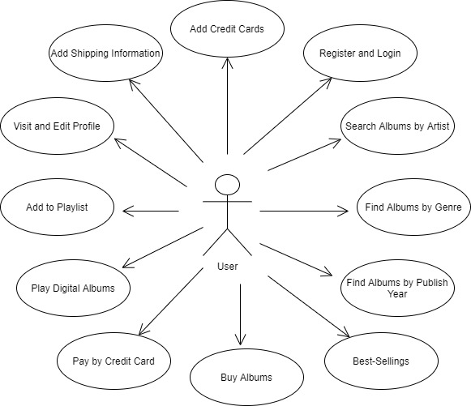
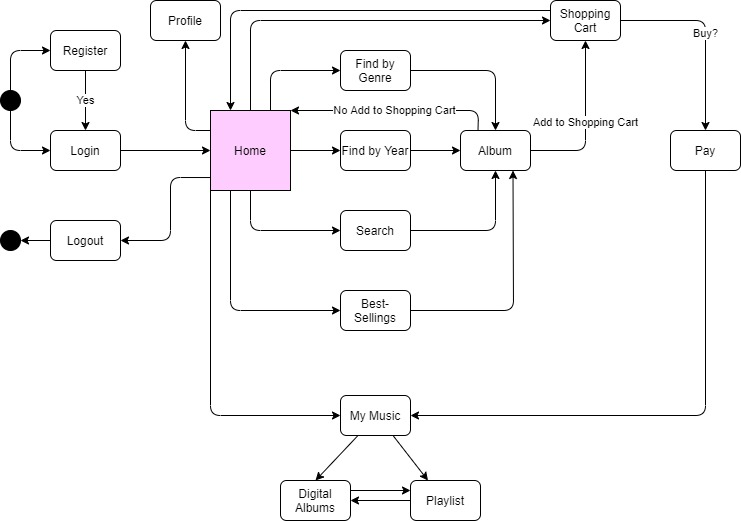
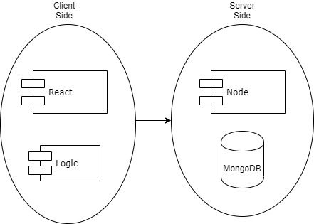
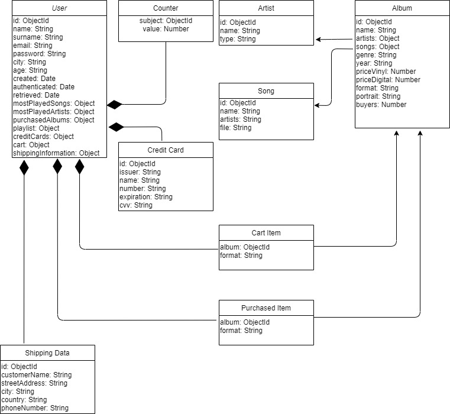
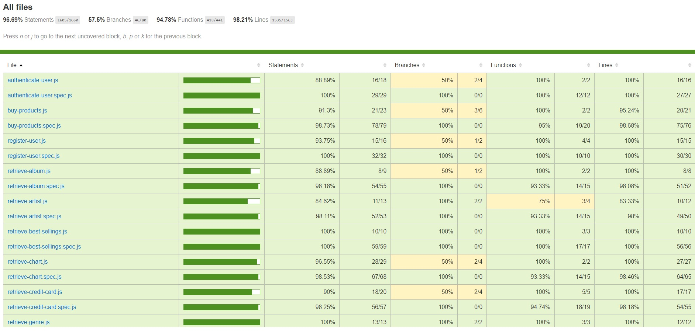
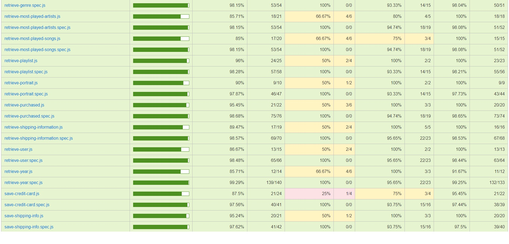
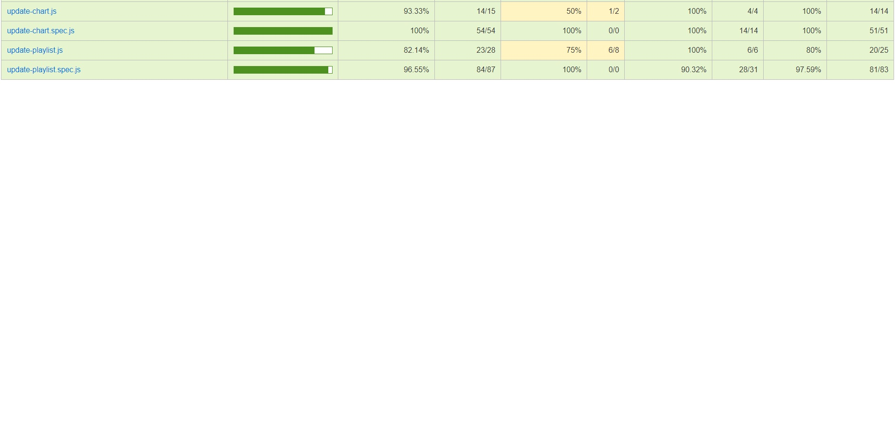

# MODUM
## Description

Modum is a music app that allows you searching, playing and buying music albums. Modum gives you the oppurtunity to buy a phisical album or its digital version. You will be able to play all your purchased music at any time within "My Modum" option. Once you bought it, play it and enjoy your music.

# Functional Description

The main features included in this app are the following:

1. User can do:

- Register and Login
- Search albums by Artist name
- Find albums by genre
- Find albums by publish year
- See Best-Sellings Albums
- Buy albums
- Pay by Credit Card
- Play digital albums
- Add to Playlist
- Visit and Edit Profile
- Add Shipping Information
- Add Credit Cards

## Use Cases

## Workflow

# Technical Description

## Blocks

## Data Model

# API Code Coverage

# TO DO

- Mobile App
- Add user rating
- Add user comments